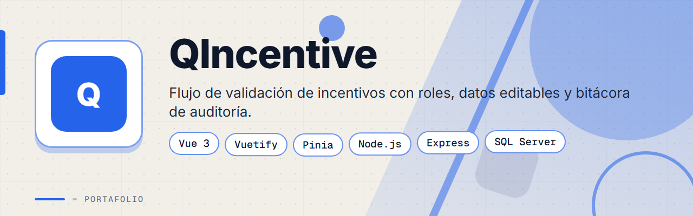
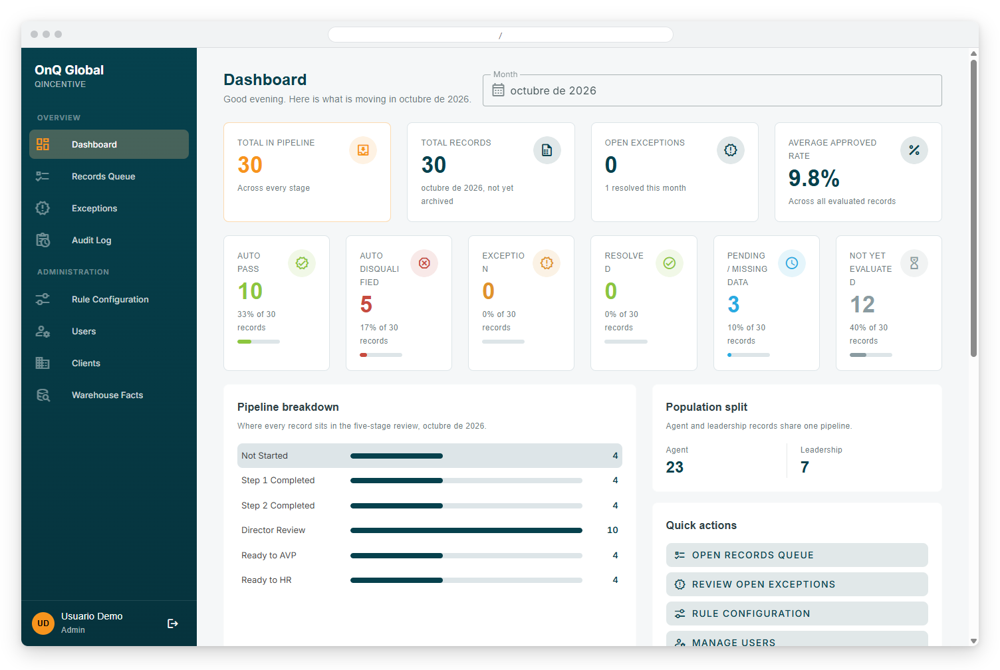
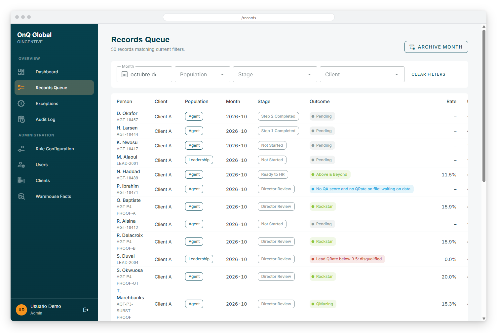
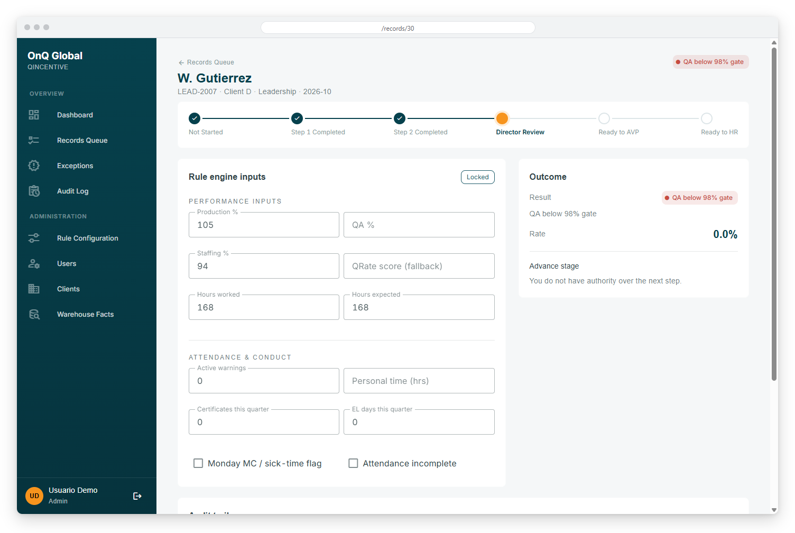
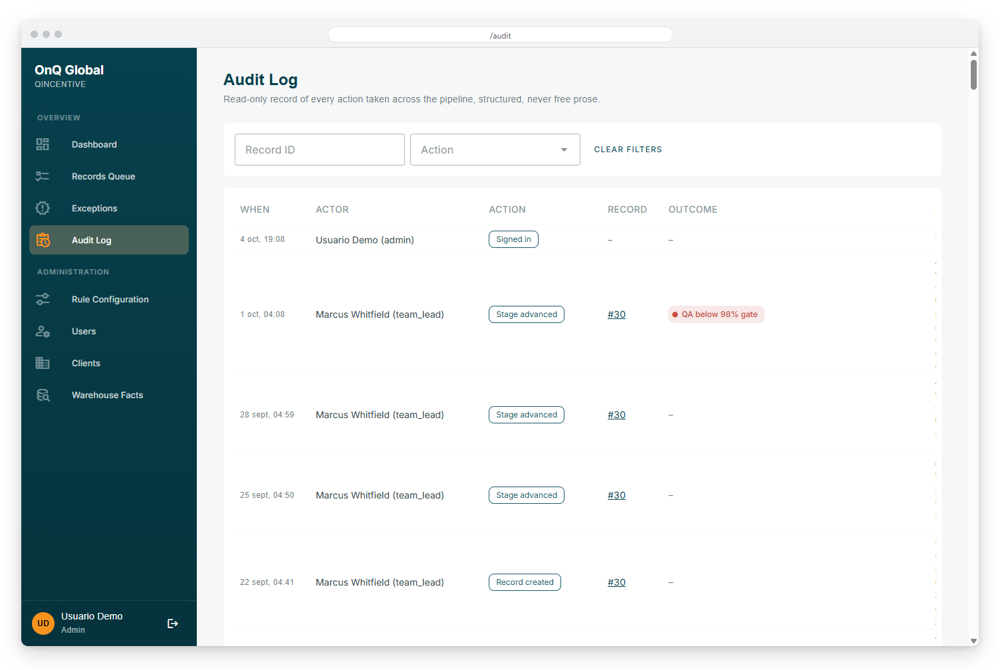
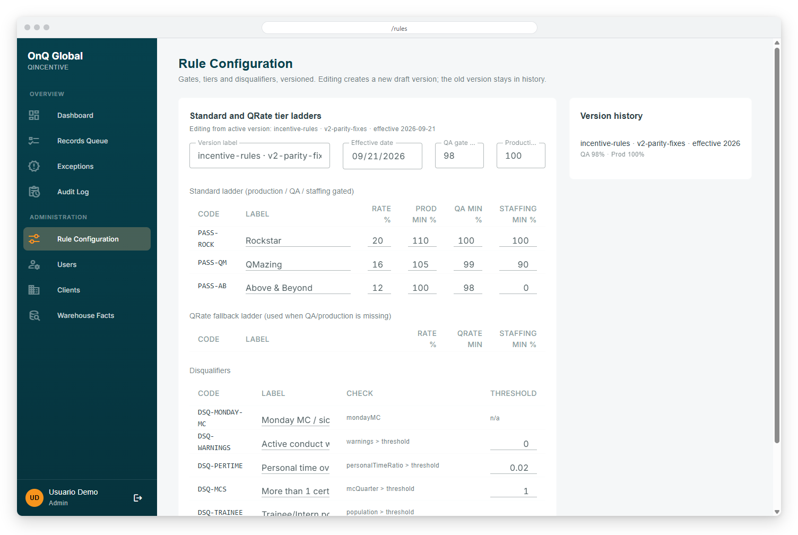
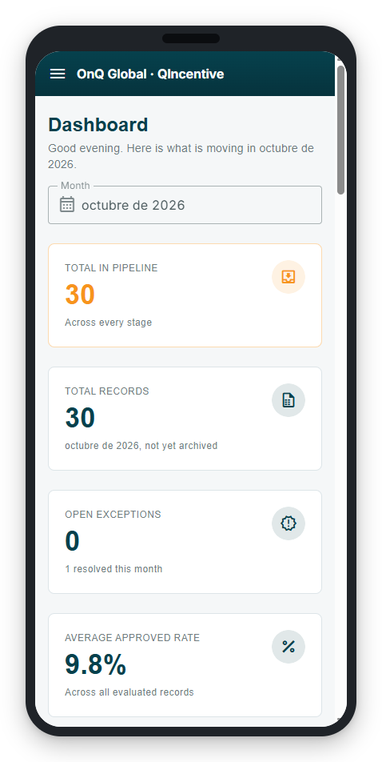
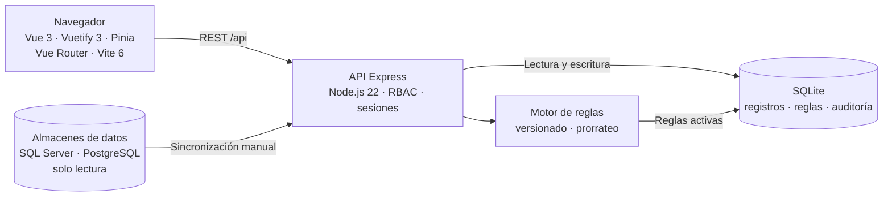

<div align="center">



# QIncentive


**Aplicación web que reemplaza un flujo de validación de incentivos hecho en Power Apps: etapas con roles, motor de reglas versionado, datos editables y bitácora de auditoría de cada acción.**

</div>

> Este es un **portafolio showcase**: el código fuente es propietario y no está incluido.

---

## Contenido

- [El Problema](#el-problema)
- [La Solución](#la-solución)
- [Funcionalidades](#funcionalidades)
- [Vista Previa](#vista-previa)
- [Arquitectura](#arquitectura)
- [Stack Tecnológico](#stack-tecnológico)
- [Instalación local](#instalación-local)
- [Roadmap](#roadmap)
- [Contacto](#contacto)

---

## El Problema

El cálculo mensual de incentivos de los agentes y líderes de un centro de operaciones se validaba con dos aplicaciones de Power Apps separadas. Eso generaba varios problemas:

- Las dos apps reconocían vocabularios de resultados distintos y no coincidían entre sí.
- Los nombres de clientes con excepciones estaban escritos directamente dentro de la lógica de las reglas.
- Los insumos (producción, calidad, cobertura) se capturaban a mano.
- No había un historial confiable de quién hizo qué ni de qué versión de las reglas se aplicó.

---

## La Solución

Una aplicación web con cuentas reales, permisos por rol y un backend que concentra la lógica. Cada registro avanza por etapas, y cada etapa solo la puede mover el rol que corresponde. El motor de reglas toma umbrales, escalas y descalificadores desde la base de datos (con versiones), así que un cambio de regla o de cliente exento es un dato y no un cambio de código. Todo queda registrado en una bitácora de auditoría de solo lectura.

---

## Funcionalidades

| Funcionalidad | Descripción |
|---------------|-------------|
| Flujo por etapas y roles | Recorrido de Sin iniciar hasta Listo para RR. HH. (pasos del líder, revisión de dirección, AVP), con una sola transición válida por etapa y por rol (líder de equipo, director, AVP, RR. HH., administrador) |
| Motor de reglas | Compuertas, escalas de pago y descalificadores con resultados automáticos; si ninguna regla aplica se abre una excepción en lugar de pagar cero |
| Reglas versionadas | Las reglas se editan como borradores y se activan como versión nueva, sin modificar las anteriores |
| Cola de excepciones | Resolución por directores y AVP, incluida la solicitud de cambio sobre un resultado automático |
| Cola de registros y panel | Listado filtrable por mes, población, etapa y cliente, con indicadores del pipeline |
| Datos editables | Insumos del registro (producción, calidad, cobertura, horas) editables con control de acceso |
| Bitácora de auditoría | Registro de solo lectura de cada acción realizada en el flujo |
| Administración | Usuarios, clientes y excepciones especiales por cliente configurables desde la interfaz |
| Sincronización de datos | Scripts manuales de solo lectura que traen datos de almacenes SQL Server y PostgreSQL |
| Prorrateo y pruebas de regresión | Cálculo con horas del período y verificación del motor contra la lógica original |

---

## Vista Previa



<table>
  <tr>
    <td width="50%">
      
      <br><b>Cola de registros</b>: listado filtrable con etapa del flujo y resultado de cada registro.
    </td>
    <td width="50%">
      
      <br><b>Detalle de registro</b>: avance por etapas, entradas del motor de reglas y resultado.
    </td>
  </tr>
  <tr>
    <td width="50%">
      
      <br><b>Auditoría</b>: bitácora de solo lectura con cada acción realizada en el flujo.
    </td>
    <td width="50%">
      
      <br><b>Configuración de reglas</b>: escalas, umbrales y descalificadores con historial de versiones.
    </td>
  </tr>
</table>



**Versión móvil**: el panel principal adaptado a pantallas pequeñas.

---

## Arquitectura



La API se organiza en rutas, servicios y repositorios. El vocabulario de etapas, roles y resultados tiene una sola fuente en el servidor y la interfaz lo consume por API, para evitar que dos pantallas definan códigos distintos.

---

## Stack Tecnológico

| Capa | Tecnología |
|------|-----------|
| Frontend | Vue 3 · Vuetify 3 · Pinia · Vue Router · Vite 6 |
| Backend | Node.js 22 · Express 4 |
| Base de datos | SQLite (nativa de Node) con migraciones |
| Orígenes de datos | SQL Server (tedious) · PostgreSQL (pg), solo lectura |
| Despliegue | VPS Linux con PM2 |

---

## Instalación local

> **Aviso:** el código es privado y propietario. Estos pasos son solo para colaboradores autorizados con acceso al repositorio.

1. Instala Node.js 22.11 o superior.
2. Instala las dependencias del monorepo:
   ```bash
   npm install
   ```
3. Crea el archivo `.env` del servidor con tus propios valores.
4. Aplica las migraciones y carga datos sintéticos de prueba:
   ```bash
   npm run db:migrate
   npm run db:seed
   ```
5. Inicia servidor y cliente en desarrollo:
   ```bash
   npm run dev
   ```

---

## Roadmap

- [ ] Vista de conteo de agentes por categoría de resultado en el panel.
- [ ] Eliminar la captura manual: alimentar los insumos desde los almacenes de datos de forma automática.
- [ ] Ampliar la resolución de identidades contra la plantilla real de empleados.
- [ ] Definir reglas para horarios especiales de ciertos clientes.
- [ ] Reconciliar el esquema de incentivos con el diccionario de datos del almacén corporativo.
- [ ] Llave de despliegue dedicada para producción.

---

## Contacto

El código fuente es propietario. Para consultas o propuestas, escríbeme:

[](mailto:pablozam1931@gmail.com)
[%206517--1870-25D366?style=for-the-badge&logo=whatsapp&logoColor=white)](https://wa.me/50765171870)
[](https://github.com/deadlyrat)

- Correo: [pablozam1931@gmail.com](mailto:pablozam1931@gmail.com)
- WhatsApp: [(507) 6517-1870](https://wa.me/50765171870)
- GitHub: [github.com/deadlyrat](https://github.com/deadlyrat)

---

*Parte del portafolio de [deadlyrat](https://github.com/deadlyrat)*
